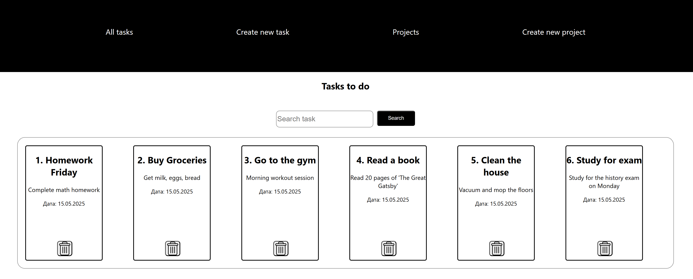
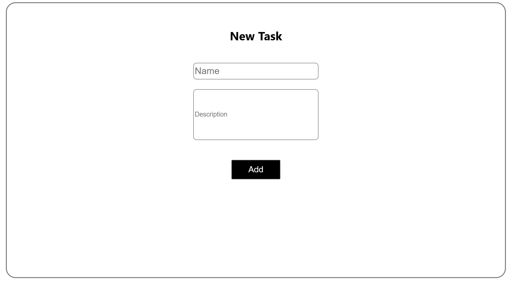

<h1 align="center">
  Personal Notebook website BETA
</h1>
<h3 align="center">
  This project was made for final exam of IT-Step
</h3>

## The main goal was to create notebook website using react
The task name "To-do list"
Task had to have those possibilities:
1. Adding new task
2. Delete task
3. Edit task
4. Add a project
5. Search task

Unfortunately some of them had not been created yet.

Available possibilities:
1. Adding new task
2. Delete task
3. Search task
   
### `all website was written on react-router-dom modul `

### `How to use`:
* Git clone <url>
* In bash go to folder notebook
* npm install
* npm start

### Was used:
- JavaScript
- HTML/CSS
- React
- Router-dom

### This project was made by IT-Step student all information you can see here
[🌐 Go to IT-Step](https://if.itstep.org/)
